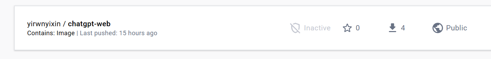

>来源与Youtube博主：**Youtube：**[【科技小飞哥】](https://www.youtube.com/@techxiaofei)，欢迎关注。
>博主github源码：https://github.com/techxiaofei/chatgpt-web
>我只是介绍用aws亚马逊云服务和修改头像，名字等方法
# ChatGPT Web

> 声明：此项目只发布于 Github，基于 MIT 协议，免费且作为开源学习使用。并且不会有任何形式的卖号、付费服务、讨论群、讨论组等行为。谨防受骗。


### 启动新实例

### 创建服务器（名字可以随便取，系统选择ubuntu）

### 创建密钥对，安全组全选，然后启动

### 检查安全组，入站规则像我一样就可以

### 直接连接实例就行


### 接下来获取openai key（需要魔法上网）
在账户关联里面找到api key创建新密钥
### 不需要换名字头像只需要在服务器运行以下命令即可
```shell
先修改root用户密码
sudo passwd root

切换到root用户
su  root

# 更新包管理器
sudo apt-get update

# 安装docker
apt install docker.io

# 下载docker镜像
docker pull techxiaofei/chatgpt-web:latest

# 给镜像打标签
docker tag techxiaofei/chatgpt-web chatgpt-web

# 后台运行，可修改主机端口 比如：80->8080，3002是容器端口，不可修改
# your_api_key替换成你的API Key
docker run --name chatgpt-web -d -p 0.0.0.0:80:3002 --env OPENAI_API_KEY=你的openai-key chatgpt-web

# 后台运行，带密码访问
# 添加环境变量方式： --env KEY=XXX
docker run --name chatgpt-web -d -p 0.0.0.0:80:3002 --env OPENAI_API_KEY=你的openai-key --env AUTH_SECRET_KEY=techxiaofei chatgpt-web

# 停掉进程（如需重启）
docker stop chatgpt-web
docker rm chatgpt-web
```

### 需要换名字头像的需要下源码（免费服务器建议先用虚拟机将镜像上传docker hub，免费服务器性能不够编译不出来）
头像，名称，描述目录：src/store/modules/user/helper.ts
标题目录：index.html
密码文本提示目录：src/locales/zh-CN.ts
以下是免费服务器修改方法
```shell
先修改root用户密码（新的虚拟机）
sudo passwd root

切换到root用户
su  root

# 更新包管理器
sudo apt-get update

# 安装docker
apt install docker.io

# 下载源码
git clone https://github.com/techxiaofei/chatgpt-web.git
cd chatgpt-web（以下都需要在这个路径下运行）

修改名字头像
vim  src/store/modules/user/helper.ts

# 安装依赖
# 安装nodejs
apt install nodejs

# 安装node包管理器
apt install npm

# 升级包管理工具upgrade
npm install -g n

# 升级到node.js最新稳定版
n stable # latest（我用的ubuntu18版本，22版本可能更新不了，我的是这样）

hash -r

# 查看版本，如果是 18及以上就可以了
node -v

# 安装pnpm
npm install pnpm -g

# 编译
pnpm bootstrap

pnpm build（这一步非常慢，用免费服务器就会在这里卡住）

docker build -t chatgpt-web .

```

#接下来要上传docker（注册docker需要魔法上网  https://hub.docker.com/）
我的用户名

```shell
[root@localhost ~]#  docker login
Login with your Docker ID to push and pull images from Docker Hub. If you don't have a Docker ID, head over to https://hub.docker.com to create one.
Username:    ##输入账号
Password:          ##输入密码

```

```shell
#查看镜像
docker images 
REPOSITORY          TAG（记住这两个就行）
chatgpt-web         latest
tag修改镜像名称
推送镜像的规范是：
docker push  注册docker用户名/REPOSITORY:TAG 

比如我的就是
docker push yirwnyixin/chatgpt-web:latest

再次查看镜像
docker images 
会变成这样
REPOSITORY                  TAG
yirwnyixin/chatgpt-web      latest

push到Docker Hub
docker push yirwnyixin/chatgpt-web:latest
```
#就可以看到镜像



#接下来回到服务器
```shell
先修改root用户密码
sudo passwd root

切换到root用户
su  root

# 更新包管理器
sudo apt-get update

# 安装docker
apt install docker.io

# 下载docker镜像
docker pull yirwnyixin/chatgpt-web:latest（仓库名:TAG 对应yirwnyixin/chatgpt-web（你的仓库名）：latest）

# 给镜像打标签
docker tag yirwnyixin/chatgpt-web chatgpt-web

# 后台运行，可修改主机端口 比如：80->8080，3002是容器端口，不可修改（到这里就可以结束）
docker run --name chatgpt-web -d -p 0.0.0.0:80:3002 --env OPENAI_API_KEY=你的openai-key chatgpt-web

# 后台运行，带密码访问
# 添加环境变量方式： --env KEY=XXX
docker run --name chatgpt-web -d -p 0.0.0.0:80:3002 --env OPENAI_API_KEY=你的openai-key --env AUTH_SECRET_KEY=techxiaofei chatgpt-web

# 停掉进程（如需重启）
docker stop chatgpt-web
docker
```
接下来就可以复制你的服务器公有ip（不用带端口）去网页查看了
有域名的还可以用cloudfrale将你的IP托管到域名上，就可以直接输入域名，不用输ip了


