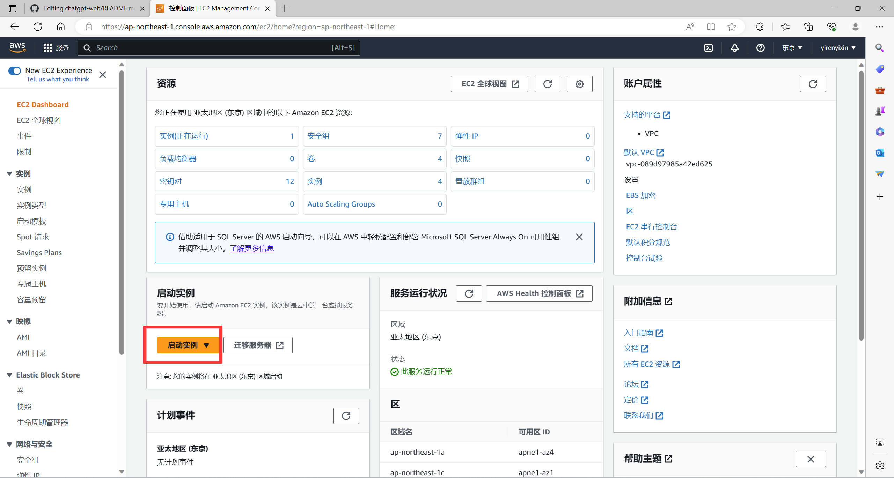
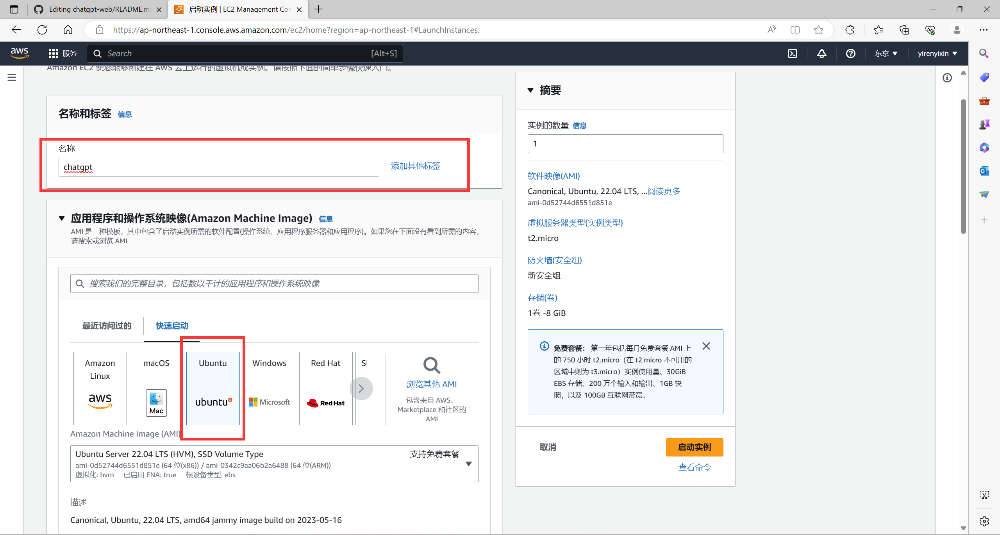
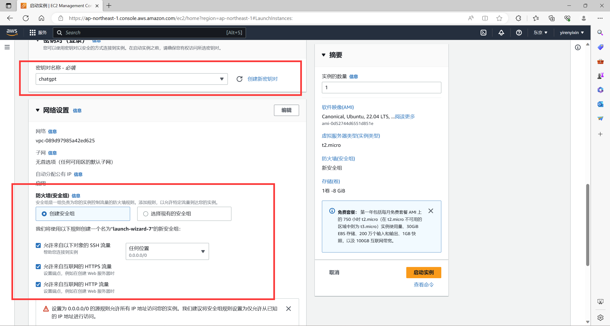
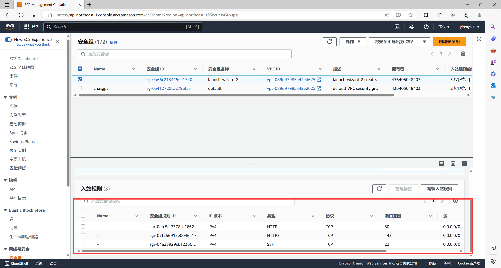
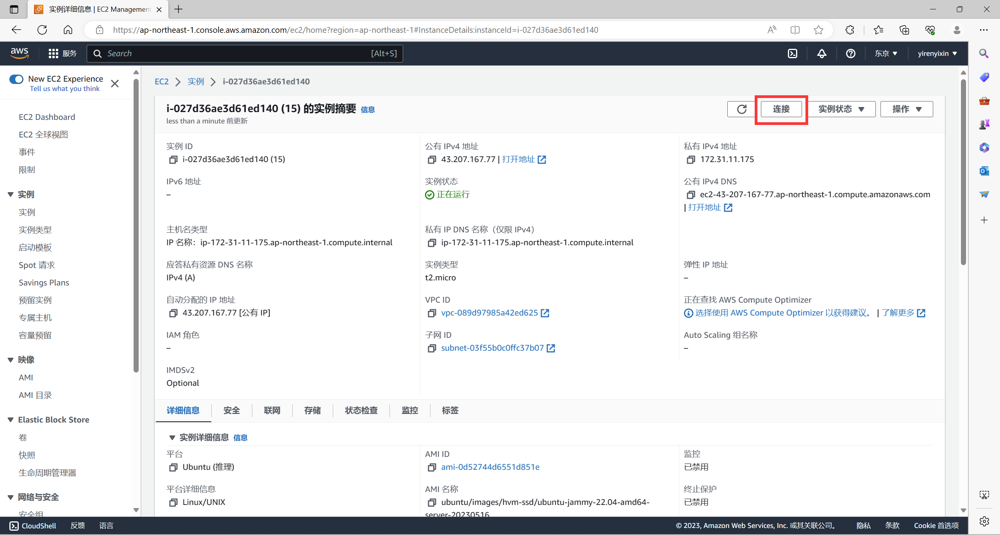
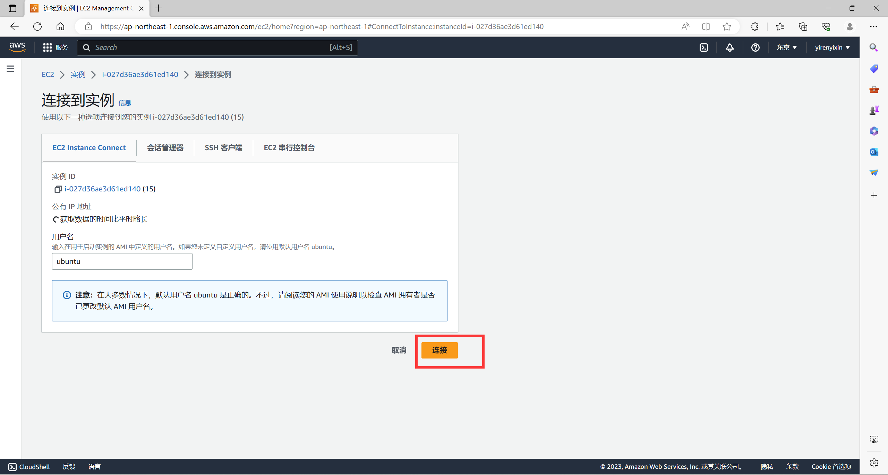

# 关于我
科技互联网领域自媒体博主，所有视频首发于**Youtube：**[【科技小飞哥】](https://www.youtube.com/@techxiaofei)，欢迎关注。加入**粉丝群：**[【科技小飞哥的粉丝群】](https://t.me/+m0d7_ft5Utw2MzY1)


# ChatGPT Web

> 声明：此项目只发布于 Github，基于 MIT 协议，免费且作为开源学习使用。并且不会有任何形式的卖号、付费服务、讨论群、讨论组等行为。谨防受骗。


## 介绍

支持双模型，提供了两种非官方 `ChatGPT API` 方法

| 方式                                          | 免费？ | 可靠性     | 质量 |
| --------------------------------------------- | ------ | ---------- | ---- |
| `ChatGPTAPI(gpt-3.5-turbo-0301)`                           | 否     | 可靠       | 相对较笨 |
| `ChatGPTUnofficialProxyAPI(网页 accessToken)` | 是     | 相对不可靠 | 聪明 |

对比：
1. `ChatGPTAPI` 使用 `gpt-3.5-turbo` 通过 `OpenAI` 官方 `API` 调用 `ChatGPT`
2. `ChatGPTUnofficialProxyAPI` 使用非官方代理服务器访问 `ChatGPT` 的后端`API`，绕过`Cloudflare`（依赖于第三方服务器，并且有速率限制）

警告：
1. 你应该首先使用 `API` 方式
2. 使用 `API` 时，如果网络不通，那是国内被墙了，你需要自建代理，绝对不要使用别人的公开代理，那是危险的。
3. 使用 `accessToken` 方式时反向代理将向第三方暴露您的访问令牌，这样做应该不会产生任何不良影响，但在使用这种方法之前请考虑风险。
4. 使用 `accessToken` 时，不管你是国内还是国外的机器，都会使用代理。默认代理为 [acheong08](https://github.com/acheong08) 大佬的 `https://bypass.churchless.tech/api/conversation`，这不是后门也不是监听，除非你有能力自己翻过 `CF` 验证，用前请知悉。[社区代理](https://github.com/transitive-bullshit/chatgpt-api#reverse-proxy)（注意：只有这两个是推荐，其他第三方来源，请自行甄别）
5. 把项目发布到公共网络时，你应该设置 `AUTH_SECRET_KEY` 变量添加你的密码访问权限，你也应该修改 `index.html` 中的 `title`，防止被关键词搜索到。

切换方式：
1. 进入 `service/.env.example` 文件，复制内容到 `service/.env` 文件
2. 使用 `OpenAI API Key` 请填写 `OPENAI_API_KEY` 字段 [(获取 apiKey)](https://platform.openai.com/overview)
3. 使用 `Web API` 请填写 `OPENAI_ACCESS_TOKEN` 字段 [(获取 accessToken)](https://chat.openai.com/api/auth/session)
4. 同时存在时以 `OpenAI API Key` 优先

环境变量：

全部参数变量请查看或[这里](#环境变量)

```
/service/.env.example
```


### 前端网页
根目录下运行以下命令
```shell
pnpm dev
```

### 启动新实例

### 创建服务器（名字可以随便取，系统选择ubuntu）

### 创建密钥对，安全组全选，然后启动

### 检查安全组，入站规则像我一样就可以

### 直接连接实例就行



### 接下来获取openai key（需要魔法上网）
在账户关联里面找到api key创建新密钥
### 不需要换名字头像只需要在服务器运行以下命令即可
```shell
先修改root用户密码
sudo passwd root

切换到root用户
su  root

# 更新包管理器
sudo apt-get update

# 安装docker
apt install docker.io

# 下载docker镜像
docker pull techxiaofei/chatgpt-web:latest

# 给镜像打标签
docker tag techxiaofei/chatgpt-web chatgpt-web

# 后台运行，可修改主机端口 比如：80->8080，3002是容器端口，不可修改
# your_api_key替换成你的API Key
docker run --name chatgpt-web -d -p 0.0.0.0:80:3002 --env OPENAI_API_KEY=你的openai-key chatgpt-web

# 后台运行，带密码访问
# 添加环境变量方式： --env KEY=XXX
docker run --name chatgpt-web -d -p 0.0.0.0:80:3002 --env OPENAI_API_KEY=你的openai-key --env AUTH_SECRET_KEY=techxiaofei chatgpt-web

# 停掉进程（如需重启）
docker stop chatgpt-web
docker rm chatgpt-web
```

### 需要换名字头像的需要下源码（免费服务器建议先用虚拟机将镜像上传docker hub，免费服务器性能不够编译不出来）
头像，名称，描述目录：src/store/modules/user/helper.ts
标题目录：index.html
密码文本提示目录：src/locales/zh-CN.ts
以下是免费服务器修改方法
```shell
先修改root用户密码（新的虚拟机）
sudo passwd root

切换到root用户
su  root

# 更新包管理器
sudo apt-get update

# 安装docker
apt install docker.io

# 下载源码
git clone https://github.com/techxiaofei/chatgpt-web.git
cd chatgpt-web（以下都需要在这个路径下运行）

修改名字头像
vim  src/store/modules/user/helper.ts

# 安装依赖
# 安装nodejs
apt install nodejs

# 安装node包管理器
apt install npm

# 升级包管理工具upgrade
npm install -g n

# 升级到node.js最新稳定版
n stable # latest（我用的ubuntu18版本，22版本可能更新不了，我的是这样）

hash -r

# 查看版本，如果是 18及以上就可以了
node -v

# 安装pnpm
npm install pnpm -g

# 编译
pnpm bootstrap

pnpm build（这一步非常慢，用免费服务器就会在这里卡住）

docker build -t chatgpt-web .

```

#接下来要上传douker
```shell
[root@localhost ~]#  docker login
Login with your Docker ID to push and pull images from Docker Hub. If you don't have a Docker ID, head over to https://hub.docker.com to create one.
Username:    ##输入账号
Password:          ##输入密码

```

```shell
#查看镜像
docker images 
REPOSITORY          TAG（记住这两个就行）
chatgpt-web         latest
tag修改镜像名称
推送镜像的规范是：
docker push  注册docker用户名/REPOSITORY:TAG 

比如我的就是
docker push yirwnyixin/chatgpt-web:latest

```


